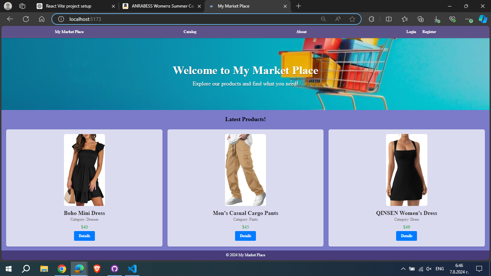
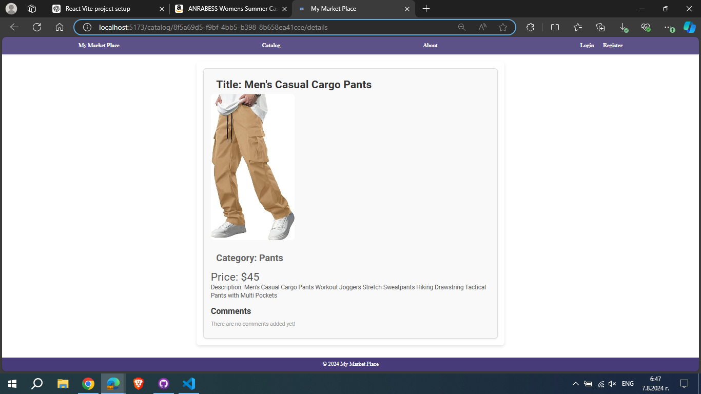
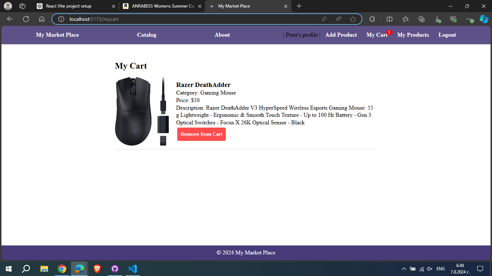
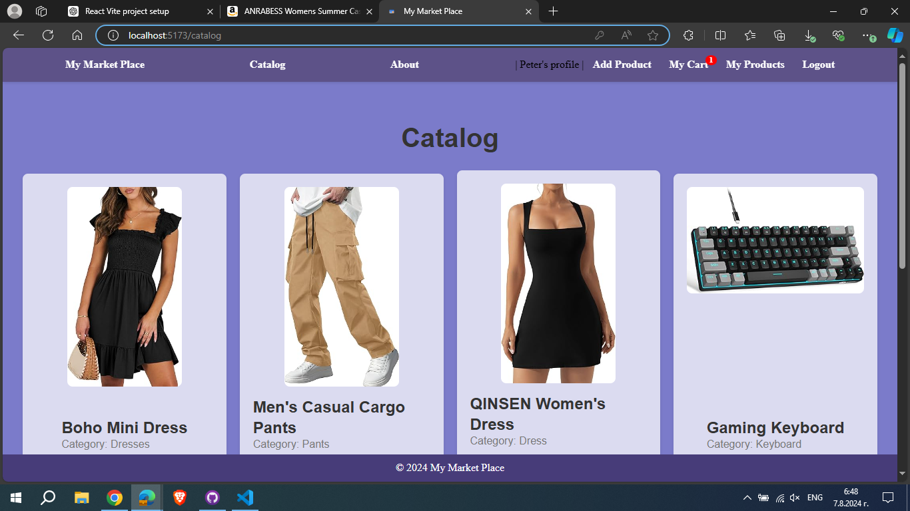
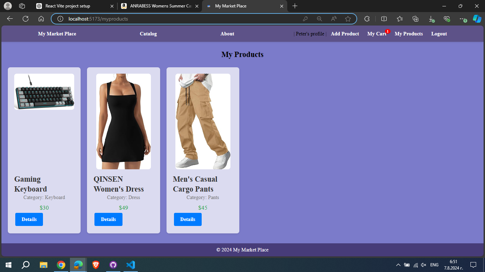

# my-market-place
React exam project for SoftUni

Project Name: My Market Place

The application is deployed to Firebase and can be accessed on https://my-market-place-1980.web.app/.

Description:
"My Market Place" is a web application that serves as an online marketplace where users can browse, create, and manage products. The application is built using React with Vite for development and utilizes a practice server from SoftUni. The project is divided into public and private sections, ensuring certain features are only accessible to authenticated users.

Features
Public Features:

Home Page: Introduction to the marketplace.
Catalog Page: Browse all available products.
About Page: Information about the marketplace.
Login/Register Pages: User authentication.
Product Details Page: View detailed information about a product.
Private Features:

Create Product: Authenticated users can add new products.
My Products Page: Users can view all products they have created.
Edit Product: Product owners can edit their products.
My Cart: Users can view and manage the products in their cart.
Logout: End the user session.

Setup Instructions:
Clone the Repository:

git clone <https://github.com/baito6u/my-market-place.git>
cd my-market-place
Install Dependencies:

npm install

Start the Development Server:
cd server
node server.js or firebase serve

Server is running: Open your web browser and go to http://localhost:3000 or http://localhost:5000/my-market-place-1980/europe-west1/api

Open the Application:
cd client
npm run dev for development or npm run build:deploy for deploy to firebae

Project is running localy: Open your web browser and go to http://localhost:5173
The application is deployed to Firebase and can be accessed on https://my-market-place-1980.web.app/

Key Features:
Home Page: Displays the latest products in a responsive grid layout.

Product Details Page: Shows detailed information about a product, including comments and an option to add the product to the cart.

Cart: Allows users to view and manage products they intend to purchase, with a counter displayed in the navigation bar.

Catalog Page: 

My Products Page: Users can view all products they have created.

404 Page: Displays a custom error message for invalid routes.

Additional Notes:
Responsive Design: The application uses CSS modules for scoped styles and media queries to ensure a responsive design.
Modern Practices: The project follows modern React practices, including hooks and context API for state management.
Error Handling: The application includes a 404 page for handling invalid routes gracefully.
By following the setup instructions and utilizing the provided project structure, you should be able to get the My Market Place application up and running efficiently.